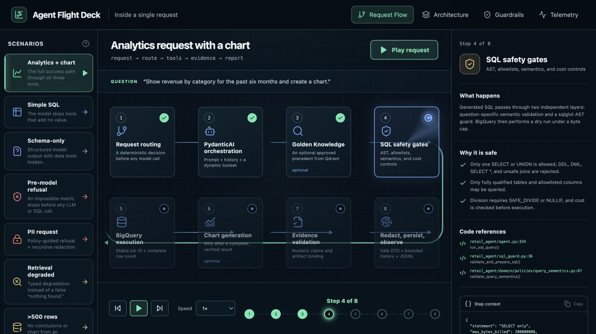

# Retail Data Analysis Chat Assistant

An executive-facing retail analytics assistant with a working CLI prototype and
a production high-level design. The runtime uses Clean Architecture boundaries,
PydanticAI 2.9 structured agents, BigQuery, Qdrant, Gemini, bounded multi-turn
history, evidence validation, and automatic chart generation.

## Reviewer Quick Tour

Start with the credential-free **Agent Flight Deck**. It visualizes eight
request paths, Clean Architecture boundaries, independent safety gates, and the
telemetry emitted across one turn:

```bash
just walkthrough-ui
```

Open [http://127.0.0.1:5173](http://127.0.0.1:5173) and follow the four tabs from
left to right. The walkthrough is a static reviewer aid grounded in the current
code; it does not call Gemini, BigQuery, or Qdrant and is not a second product
UI. If `just` is unavailable, use the equivalent npm commands in the
[Agent Flight Deck README](agent-flow-explorer/README.md).



Continue with [PROJECT_WALKTHROUGH.md](PROJECT_WALKTHROUGH.md) for the matching
code tour, reviewer commands, requirement map, and prototype-versus-production
boundary.

## Command Shortcuts

If [`just`](https://just.systems/) is installed, the root `justfile` provides
shortcuts for the common developer and reviewer workflows. Run `just` to list
every available recipe.

```bash
just walkthrough-ui
just setup
just check
just review
just live-setup
just reviewer-live
```

`just check` is the complete credential-free local gate. `just review` also
builds and verifies the runtime and evaluation images. The sections below keep
the underlying commands available for readers who do not use `just`.

## Runtime Architecture

```text
CLI / future API
        ↓
Application use cases and ports
        ↓
Domain models and deterministic policies
        ↑
Infrastructure adapters (Gemini, BigQuery, Qdrant, charts, telemetry)
```

`retail_agent/bootstrap.py` is the composition root. The CLI only parses input,
selects a conversation, calls use cases, renders DTOs, and maps exit codes. A
future HTTP adapter can invoke the same `AnalyzeQuestion` use case.

During a turn, the PydanticAI agent chooses among bounded tools:

- `retrieve_golden_examples`: model-selected approved precedent for metrics,
  cohorts, joins, filters, rankings, time windows, comparisons, returns,
  customer behavior, and follow-ups; the tool is skipped when it would not
  improve the answer and is unavailable after SQL succeeds;
- `run_sql_query`: guarded, dry-run-checked, read-only BigQuery execution;
- `generate_chart`: dynamically hidden until the current turn has verified rows.

Schema-only questions still use structured agent output, but dynamic tool
preparation hides retrieval, SQL, and chart execution so an introduction cannot
accidentally reach external data systems.

Data answers use a discriminated structured output and require successful SQL.
The runtime attaches only the SQL actually executed, checks numeric claims
against returned rows, rejects narrative tables/row dumps, validates chart
references, then applies deterministic PII redaction.

## Quick Start With Docker

1. Prepare configuration:

   ```bash
   cp .env.example .env
   ```

2. Set `GOOGLE_CLOUD_PROJECT` and authenticate with Application Default
   Credentials for BigQuery and the default Vertex-hosted
   `google-cloud:gemini-3.5-flash` model.

   ```bash
   export PROJECT_ID=your-project-id
   gcloud services enable bigquery.googleapis.com aiplatform.googleapis.com --project "$PROJECT_ID"
   gcloud auth application-default login
   gcloud auth application-default set-quota-project "$PROJECT_ID"
   ```

3. Build the exact current image, start and wait for Qdrant, recreate the Golden
   index, display safe diagnostics, and prove all chart dependencies:

   ```bash
   just live-setup
   ```

   This cached build runs before every `just ask`, `just chat`, and
   `just index-golden` invocation, preventing reviewers from exercising a stale
   image.

4. Ask a question or start a conversation:

   ```bash
   just ask "Plot monthly revenue by category" manager_a
   just chat manager_a
   ```

5. Run the complete documented reviewer sequence:

   ```bash
   just reviewer-live
   ```

6. Individual diagnostics remain available:

   ```bash
   just diagnostics
   just chart-smoke
   just bq-smoke
   ```

Docker Compose and local uv runs both write chart artifacts directly to the
host-visible `artifacts/charts/` directory.

For an offline Qdrant smoke test, use deterministic demo embeddings:

```bash
docker compose run --rm -e EMBEDDING_PROVIDER=hash app index-golden --recreate
```

## Local Setup With uv

Python 3.12 and uv 0.10.8 are pinned. The lockfile is shared by local, CI, and
container builds.

```bash
uv lock --check
uv sync --frozen --all-groups
uv pip check
docker compose up -d qdrant
export QDRANT_URL=http://localhost:6333
uv run python -m retail_agent index-golden --recreate
uv run python -m retail_agent ask "Top products by sales" --user manager_b
```

The runtime CLI contains only application commands:

```bash
uv run python -m retail_agent ask "monthly revenue by category" --user manager_a
uv run python -m retail_agent chat --user manager_a
uv run python -m retail_agent index-golden --recreate
uv run python -m retail_agent bq-smoke
uv run python -m retail_agent diagnostics
uv run python -m retail_agent chart-smoke
```

## Evaluations

Evaluation code, its dataset, and `pydantic-evals` are separate from the runtime
package and image.

```bash
just eval
```

The offline gate validates immutable fixture provenance and overlap policy, then
runs guardrails plus 67 replay cases across smoke, held-out analytical,
multi-turn, retrieval, adversarial, and regression partitions. Individual
commands remain available through `just quality-*` recipes.

The quality-v8 evaluator uses a three-way semantic decision. Structurally and
numerically proven SQL equivalence passes even when Gemini uses different CTEs,
window functions, conditional aggregates, or aliases. A violated table,
filter, period, grain, calculation, completeness, privacy, or chart invariant
fails. Only genuinely ambiguous lineage/result mappings produce `REVIEW`, which
blocks the suite without being counted as a model failure. The gate does not
use an LLM judge, alias allowlist, or lowered correctness threshold.

The dedicated container target provides the same entrypoint:

```bash
docker build --target evaluation -t retail-agent-evaluation:local .
docker run --rm retail-agent-evaluation:local guardrails
docker run --rm retail-agent-evaluation:local quality --mode replay
```

Credentialed evaluation is tiered. The daily canary repeats the smoke set three
times; a manually selected release candidate repeats smoke plus the held-out set
five times. Both run only from the default branch in the protected
`quality-live-evaluation` environment, use workload identity, enforce a
per-query BigQuery cap, record reference-query cost separately, and upload
content-addressed evidence. Release approval consumes that frozen evidence
without rerunning the model or warehouse.

After a failed run, repeatable `--case-id` options can rerun only affected cases
for remediation evidence. Such a subset is diagnostic and never substitutes
for the complete 34-case release artifact and blinded human review. The latest
reviewer-reliability evidence is recorded in
[reports/EVALUATOR_REMEDIATION_2026-07-15.md](reports/EVALUATOR_REMEDIATION_2026-07-15.md).

See [docs/qa.md](docs/qa.md) for the dataset contract, live tiers, separate
blinded A/B and pointwise analyst packets, release thresholds, and the complete
acceptance matrix.

## Configuration

Settings precedence is:

```text
explicit initialization → environment → .env → YAML → safe defaults
```

`config/agent.yaml` defines nested model, BigQuery, retrieval, agent-limit,
conversation, chart, safety, and observability settings. Credentials use
`SecretStr` and are masked when settings are serialized.

Common environment aliases include:

| Area | Variables |
|---|---|
| Gemini | `LLM_MODEL` defaults to `google-cloud:gemini-3.5-flash`; `GOOGLE_CLOUD_LLM_LOCATION`, `GOOGLE_CLOUD_LLM_FALLBACK_LOCATION`, and `GOOGLE_CLOUD_EMBEDDING_LOCATION` configure its Vertex chat/embedding routes, while `GOOGLE_API_KEY` authenticates optional `google:` chat and embedding models; `EMBEDDING_PROVIDER` and `EMBEDDING_MODEL` select embeddings; legacy `GOOGLE_CLOUD_LOCATION` remains a compatibility fallback |
| BigQuery | `GOOGLE_CLOUD_PROJECT`, `BIGQUERY_LOCATION`, `BQ_MAX_BYTES_BILLED` |
| Retrieval | `QDRANT_URL`, `QDRANT_API_KEY`, `QDRANT_COLLECTION`, `GOLDEN_TOP_K` |
| Agent limits | `MAX_AGENT_REQUESTS`, `MAX_TOOL_CALLS`, `MAX_AGENT_TOKENS`, `MAX_SQL_RETRIES`, `MAX_CHART_RETRIES`, `MAX_OUTPUT_RETRIES`, `LLM_REQUEST_TIMEOUT_SECONDS` |
| Conversation | `MAX_CHAT_HISTORY_TURNS`, `MAX_CHAT_HISTORY_BYTES` |
| Charts | `CHART_TIMEOUT_SECONDS` |
| Telemetry | `AGENT_LOG_PATH`, `LOGFIRE_TOKEN` |

## Chart Execution Security

The prototype executes model-generated chart Python automatically in a
short-lived subprocess with a minimal environment, fixed input/output names,
strict source/output/capture limits, and a timeout. It supplies only the current
verified query rows through `input.json` and accepts validated PNG or passive
SVG output. Matplotlib, NumPy, pandas, and seaborn are explicit runtime
dependencies and are imported during the image build. `chart-smoke` then runs
known-good PNG, SVG, pandas, seaborn, and 156-cell heatmap programs through the
same executor used by the agent.

This subprocess is a reliability boundary, not a security sandbox. Production
must run generated code in an isolated external worker outside the application
container, with separate credentials, filesystem, network policy, CPU, memory,
and time limits.

## Verification

```bash
just check
just container-check
just review
```

The runtime image intentionally excludes `evals/`, its datasets, and
`pydantic-evals`.

## Scope

Implemented in the prototype:

- Clean Architecture packages and import-boundary tests;
- typed settings, packaged prompts, composition root, and thin CLI;
- versioned conditional-retrieval instructions backed by deterministic SQL-tool
  visibility, plus model-selected SQL/chart tools with timeouts and usage
  budgets; retrieval outages degrade without blocking SQL;
- multi-turn conversation state with compacted verified tool context;
- SQL AST guardrails, safe-column allowlists, cost caps, stable job IDs, and
  post-submission outcome protection;
- structured output, evidence validation, explicit no-data disclosure without
  broadening or replaying a valid empty query, PII redaction, degraded
  dependency handling, and structured telemetry;
- partitioned replay/live evaluations, repeated-run reliability statistics,
  calibrated human review, immutable release evidence, and separate approval;
- local automatic chart execution and separate runtime/evaluation images.

The production design—not this CLI prototype—covers durable OIDC-authenticated
APIs, PostgreSQL persistence, saved reports, destructive confirmation, audit
exports, human Golden Knowledge promotion, and persona administration. See
[docs/architecture.md](docs/architecture.md) and
[docs/requirements.md](docs/requirements.md).
