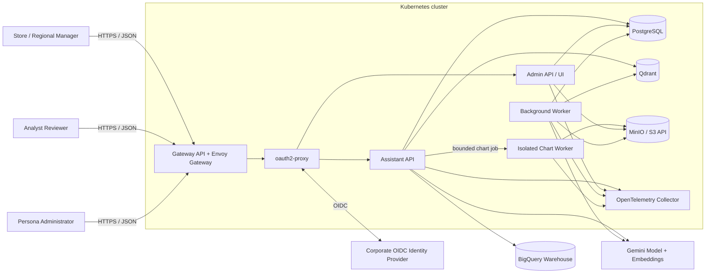
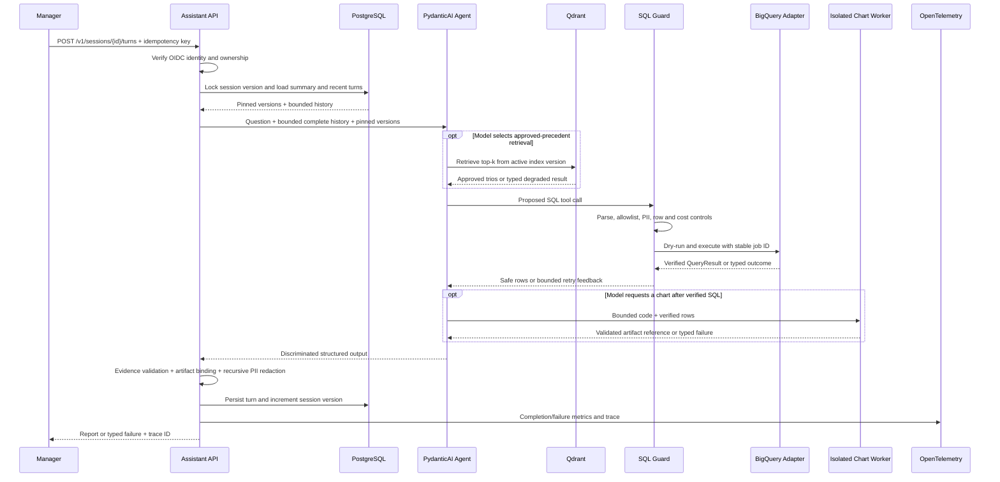
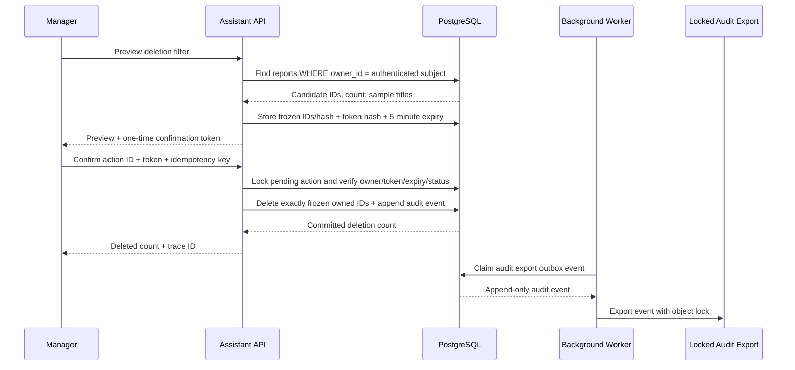
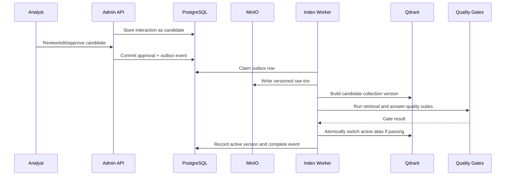

# Production Architecture

## 1. Scope And Decision

This document is the production high-level design for the Retail Data Analysis
Assistant. The CLI in this repository is the working prototype; the API,
administration, and persistence services below define the production target and
are deliberately not represented as already implemented.

Kubernetes is the single reference runtime. The design is portable across EKS,
GKE, AKS, and conformant on-premises clusters because application components use
OCI containers and standard protocols rather than cloud-specific compute,
identity, messaging, storage, secrets, or telemetry APIs.

BigQuery and Gemini remain the initial warehouse and AI implementations because
they fit the assignment data and model requirements. They sit behind explicit
ports and do not force the rest of the platform onto Google Cloud.

### Decision record

- A full GCP-managed stack was rejected: using BigQuery does not require choosing
  GCP for compute, identity, transactional storage, secrets, or observability.
- A list of interchangeable targets such as Cloud Run, ECS, and Kubernetes was
  rejected because it leaves production behavior and operations undecided.
- Kubernetes was selected as the concrete portability layer. Its operational
  cost is justified only if cloud portability or an existing Kubernetes platform
  is a real organizational requirement.
- Managed replacements are allowed only when they preserve the contracts in this
  document. They are substitutions for the reference component, not additional
  primary architectures.

## 2. System Context And Trust Boundaries

The public trust boundary ends at the Gateway. `oauth2-proxy` completes the OIDC
flow, and every application service independently verifies the signed token's
issuer, audience, expiry, and role claims. The authenticated subject is the only
source of `user_id`; request bodies cannot override it.

The data boundary separates:

- operational metadata and ownership state in PostgreSQL;
- approved artifacts, backups, and immutable exports in S3-compatible storage;
- replaceable semantic indexes in Qdrant;
- read-only analytics in BigQuery;
- external model and embedding calls through PydanticAI adapters.

## 3. Components And Communication

| Component | Responsibility | Communication | Scaling model |
|---|---|---|---|
| Envoy Gateway | TLS termination, routing, request-size and rate limits | HTTPS | At least two replicas |
| oauth2-proxy | OIDC login and signed identity forwarding | OIDC and HTTPS | At least two replicas |
| Assistant API | Session turns, retrieval, agent orchestration, SQL safety, reports | HTTPS/JSON, PostgreSQL, Qdrant HTTP/gRPC, BigQuery/Gemini APIs | HPA, minimum two replicas |
| Admin API/UI | Persona drafts, Golden Knowledge review, audit search | HTTPS/JSON, PostgreSQL, S3 API | HPA, minimum two replicas |
| Worker | Transactional outbox, embeddings, index builds, retention, audit export | PostgreSQL, S3 API, Qdrant, Gemini | Independently scaled consumers |
| Isolated Chart Worker | Execute bounded chart jobs without application credentials | Internal job API, S3 API, OTLP | Independently scaled disposable workers |
| PostgreSQL | Durable ownership, sessions, reports, versions, audit and outbox | TLS PostgreSQL protocol | CloudNativePG three-instance HA reference |
| MinIO | Versioned Golden artifacts, reports, backups, audit exports | S3-compatible HTTPS | Distributed deployment with erasure coding |
| Qdrant | Versioned Golden Knowledge vector collections | HTTP/gRPC | Three replicas; snapshots to MinIO |
| OpenTelemetry Collector | Vendor-neutral telemetry pipeline | OTLP | At least two replicas |

All public APIs use versioned HTTPS/JSON. Internal asynchronous work uses a
PostgreSQL transactional outbox claimed with `FOR UPDATE SKIP LOCKED`; this
avoids a cloud-specific queue and prevents a database commit from diverging from
event publication. A Kafka-compatible broker can be introduced later only when
measured throughput exceeds the outbox worker's capacity.

## 4. Ports And Adapters

The implemented prototype's application layer depends on narrow ports for the
analysis agent, analytics gateway, Golden Knowledge repository, chart executor,
conversation repository, and telemetry. Its initial adapters are PydanticAI,
BigQuery, Qdrant, a bounded local Python subprocess, an in-memory repository,
and redacted JSONL events.

The production system extends that inward-facing boundary with these durable
contracts:

| Port | Required behavior | Initial adapter |
|---|---|---|
| `AnalyticsGateway` | Describe allowed schema, estimate cost, execute read-only SQL | BigQuery |
| `GoldenExampleRepository` | Retrieve approved analyst precedents and versions | Qdrant |
| `AnalysisAgent` | Structured, tool-using analysis with bounded usage | Gemini through PydanticAI |
| `EmbeddingPort` | Embed Golden Knowledge using a named model version | Gemini embeddings |
| `ConversationRepository` | Ordered, owner-scoped conversation and turn persistence | PostgreSQL |
| `ChartCodeExecutor` | Execute chart jobs over verified rows | Isolated chart worker |
| `ReportRepository` | Owner-scoped saved reports and transactional deletion | PostgreSQL |
| `PersonaRepository` | Draft/published versions and rollback pointer | PostgreSQL |
| `BlobStorePort` | Versioned artifacts, retention, and object lock | MinIO S3 API |
| `IdentityContext` | Authenticated subject and role claims | Verified OIDC JWT |
| Telemetry | Structured traces, metrics, and logs | OpenTelemetry |

Only boundaries that have real external implementations receive ports. Internal
calculation, validation, and orchestration remain explicit Python functions.

## 5. Production Data Model

PostgreSQL is the source of truth for the following logical entities:

| Entity | Essential fields and invariants |
|---|---|
| `users` | OIDC subject, display name, active state |
| `user_preferences` | User ID, version, output format, tone, created by, timestamp |
| `sessions` | ID, owner ID, status, pinned persona/prompt/model/index versions, optimistic version, expiry |
| `turns` | Session ID, sequence, idempotency key, trace ID, encrypted input/output, status, usage, timestamps; unique session/sequence and session/idempotency key |
| `saved_reports` | ID, owner ID, source turn, title, report JSON, created timestamp |
| `deletion_confirmations` | ID, owner ID, frozen candidate IDs, candidate hash, token hash, expiry, one-time status |
| `persona_versions` | Persona ID/version, editable instructions, state, reviewer, activation timestamp |
| `golden_candidates` | Source turn, proposed question/SQL/report, tags, status, reviewer |
| `golden_reviews` | Candidate, reviewer, decision, edits, reason, timestamp |
| `audit_events` | Actor, action, target IDs/hash, trace ID, outcome, timestamp; append-only to the application role |
| `outbox_events` | Event ID/type/payload, attempt count, claim time, completion time |

Application authorization always scopes reads and writes by the verified owner.
PostgreSQL row-level security provides defense in depth for sessions, turns, and
reports. Encrypted transcript columns are inaccessible to ordinary support and
analytics roles.

## 6. Conversational Analysis Flow

`POST /v1/sessions` creates a session and pins the active persona, safety prompt,
model, and Golden index versions. `POST /v1/sessions/{id}/turns` requires an
idempotency key. Concurrent turns use the session's optimistic version and
ordered sequence; conflicts return a retryable 409 rather than silently
reordering context.

The prompt uses complete recent turn groups within configured turn and byte
budgets. Large verified tool results are compacted before reuse. Failed or
partial tool trajectories remain in the encrypted audit transcript but are not
replayed into future model context.

### Model-generated chart execution

The prototype can execute chart-producing Python automatically after a verified
query. Its local executor uses a short-lived working directory, a minimal
environment, fixed input and output filenames, source/output/capture limits, and
a strict timeout. This subprocess is a reliability boundary, not a security
sandbox.

Production deployments must execute model-generated code in an isolated
external worker outside the application container. That worker needs separate
credentials, filesystem and network policy, plus independent CPU, memory, and
time limits. Query data should cross that boundary through a narrowly scoped
job payload; the worker must not receive the application service's credentials.

## 7. Saved Reports And Destructive Confirmation

Broad or ambiguous requests must be narrowed before preview. The confirmation
freezes the candidate set, so reports created afterward are never silently
included. Confirmation is single-use, expires after five minutes, and deletes
only the frozen owned IDs. Deletion, confirmation consumption, and audit insert
commit in one transaction. Audit events are exported to a MinIO bucket with
object lock and 400-day retention.

## 8. Continuous Improvement And Golden Promotion

The system never learns directly from unreviewed conversations. Explicit user
preferences are versioned in `user_preferences`; model inference cannot silently
change them. Completed interactions may become Golden candidates, but an analyst
must approve or edit them. Index versions are evaluated before alias promotion,
and the prior version remains available for rollback.

## 9. Persona Management

Persona style instructions are editable through an OIDC-protected admin UI.
Safety and tool-authorization instructions are stored separately and are not
editable by persona administrators.

Persona states are `draft`, `approved`, `published`, and `retired`. Publication
requires schema validation, length/allowed-variable checks, and the offline plus
credentialed quality suites. Publishing updates a version pointer without
redeployment. Sessions pin a persona version for reproducibility; rollback
changes the active pointer for new sessions and can explicitly migrate existing
sessions.

## 10. Failure Handling And Degradation

| Failure | User behavior | Retry/cost rule | Telemetry |
|---|---|---|---|
| Qdrant unavailable | Continue without precedent and show normal report | No model-run restart | `golden_knowledge_unavailable` and degraded retrieval metric |
| Gemini unavailable before query | Typed retryable failure; UI remains available | Provider-level bounded retry only | `agent_run_failed:model_unavailable` |
| Gemini fails after verified query | Return redacted degraded table and SQL | Never repeat completed query blindly | `agent_run_failed` with `degraded=true` |
| SQL invalid or empty | Return structured `ModelRetry` feedback | Configured 0-3 tool retries | Retry attempt, budget, failure class |
| BigQuery unavailable during validation/dry-run | Typed warehouse failure after budget | Retry is allowed because no paid execution job was submitted | Warehouse error rate and latency |
| BigQuery outcome unknown after submission | Non-retryable typed failure with trace ID | Stable job ID; never model-retry or resubmit until the original job is checked | `sql_terminal_failure`, stable job ID, warehouse error rate |
| Query exceeds byte cap | Reject before execution | No retry until SQL changes | Estimated bytes and cap |
| Chart generation fails | Return the verified analysis without an artifact and a typed chart warning | Never repeat SQL; chart retry stays within the chart job budget | Tool timing, code digest, failure class, output format/size |
| PostgreSQL unavailable | Fail turn before model call | No model spend without durable ownership/idempotency state | API error and DB saturation alerts |
| Outbox worker failure | Keep durable uncompleted event | Exponential backoff and dead-letter status | Queue age, attempts, oldest event |

Every external call has an explicit timeout. Circuit breaking prevents repeated
model/vector calls during a sustained outage. Whole-agent retries are forbidden
after a tool may have executed because they can duplicate warehouse cost.

## 11. Security And Privacy

- Enforce OIDC issuer, audience, expiry, and role validation in every service.
- Use least-privilege Kubernetes service accounts and workload identity
  federation for BigQuery where supported; do not mount long-lived JSON keys.
- Apply NetworkPolicies and explicit egress allowlists for OIDC, BigQuery,
  Gemini, and approved package endpoints.
- Use External Secrets Operator to project credentials from the operator's
  chosen secret backend. Applications only consume Kubernetes Secret volumes or
  environment references.
- Encrypt all network traffic and persistent volumes. Use separate encryption
  keys and roles for restricted transcript data.
- Keep searchable logs redacted. Encrypted transcripts have a 30-day TTL;
  saved reports remain until user deletion or organizational retention policy.
- Preserve deterministic SQL validation, safe-column allowlists, result caps,
  and final recursive redaction even when warehouse-side masking is enabled.
- Treat generated chart code as untrusted. Execute it only in disposable workers
  with no application or warehouse credentials, read-only input, isolated
  scratch storage, explicit network denial, resource quotas, and validated
  passive output.
- Record administrative, persona, Golden promotion, and destructive actions in
  the append-only audit stream.

## 12. Scaling, Availability, And Recovery

- Run at least two Assistant API, Admin API, oauth2-proxy, Gateway, and
  OpenTelemetry Collector replicas across failure domains.
- Apply horizontal autoscaling on request concurrency and latency. Bound maximum
  replicas according to Gemini and BigQuery quotas to avoid an autoscaling cost
  cascade.
- Use PodDisruptionBudgets, topology spread, readiness/startup probes, and
  graceful termination that stops accepting turns before shutdown.
- Reference PostgreSQL deployment: three CloudNativePG instances with synchronous
  HA, continuous WAL archive to MinIO, daily base backup, and quarterly restore
  test.
- Qdrant uses three replicas and snapshots each promoted index to MinIO. Qdrant
  is derived state and can be rebuilt from approved raw trios.
- MinIO uses distributed erasure coding, versioning, and object lock for audit
  exports. Backups are copied to a second failure domain.
- Initial recovery targets: PostgreSQL RPO <=5 minutes and RTO <=60 minutes;
  Qdrant RPO at the last promoted version and RTO <=2 hours by restore/rebuild.

## 13. Observability, SLOs, And Alerts

Each turn carries `session_id`, `turn_index`, `trace_id`, authenticated subject,
model version, prompt version, persona version, Golden index version, retrieved
trio IDs, SQL validation outcome, dry-run bytes, warehouse latency/rows, retry
attempts, selected tool sequence and timings, output-validation retries, usage
limits, token usage, chart digest/format/size, redaction count, terminal status,
and failure code.

OpenTelemetry exports to the reference stack:

- Prometheus and Alertmanager for metrics and alerts;
- Grafana for service, agent-quality, cost, and dependency dashboards;
- Loki for redacted structured logs;
- Tempo for traces spanning API, retrieval, model, guard, and warehouse calls.

Initial objectives:

- 99.9% monthly availability for the session-turn API, excluding valid safety
  refusals;
- successful-turn latency p95 <=20 seconds and p99 <=60 seconds;
- terminal model/warehouse failure rate below 1%;
- Qdrant-degraded turns below 1%;
- zero PII leakage and cross-owner destructive actions as hard invariants, not
  error-budgeted SLOs.

Alerts fire on five-minute terminal error rate above 5%, 15-minute p95 above 30
seconds, retrieval degradation above 10%, retry-exhaustion spikes, PostgreSQL
replication/backup failures, oldest outbox event above five minutes, or any
PII/ownership invariant violation.

## 14. Deployment And Rollback

Build one immutable OCI image per runtime component and keep evaluation tooling,
datasets, and dependencies in a separate non-production image. Supply
configuration by versioned ConfigMaps and secrets through External Secrets
Operator. Deploy with rolling updates, minimum availability, readiness gates,
and a small canary before full rollout.

Code image, model, prompt, persona, and Golden index versions are independent and
recorded on every turn. A release is promoted only after unit/integration tests,
guardrail evals, answer-quality replay evals, credentialed live evals, and analyst
usefulness review pass. Rollback restores the prior image and configuration
pointers; Golden rollback switches the Qdrant alias without rebuilding data.
