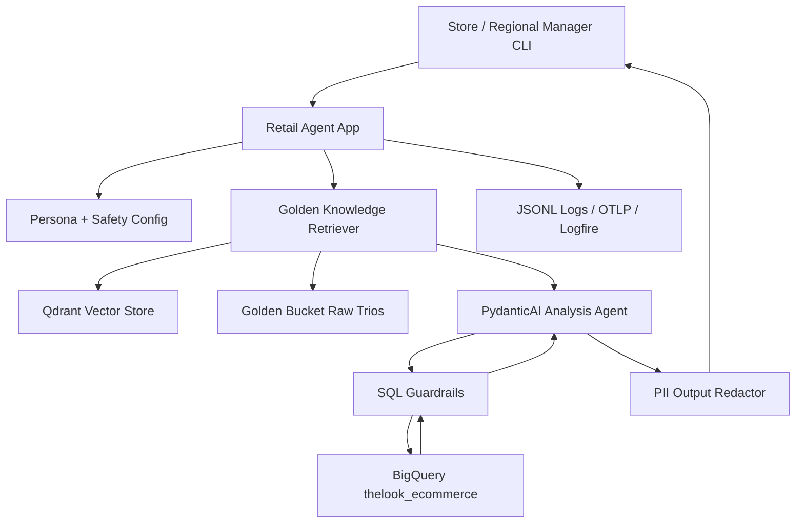
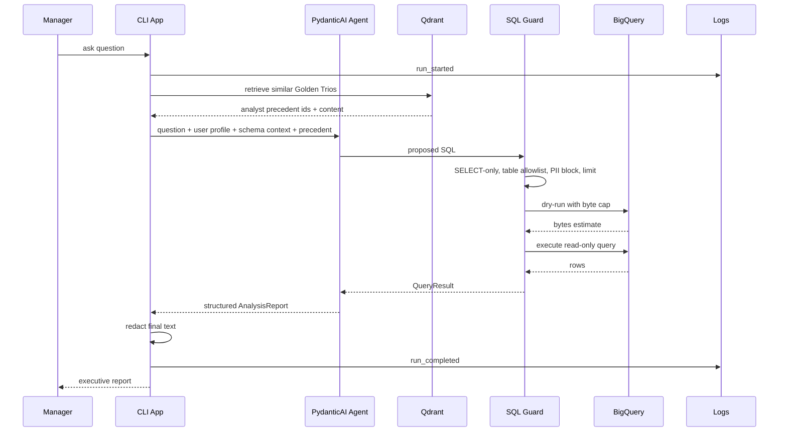

# Architecture

## High-Level Design

## Request Flow

## Core Components

- **CLI app**: Typer/Rich interface for `chat`, `ask`, `index-golden`, and `eval`.
- **PydanticAI agent**: Typed dependencies and structured `AnalysisReport` output.
- **Golden Knowledge**: Raw JSONL seed data plus Qdrant vector index. Production stores raw trios in object storage or a database and indexes them in Qdrant Cloud/self-hosted.
- **SQL guardrails**: `sqlglot` parses generated SQL before BigQuery sees it.
- **BigQuery runner**: Runs dry-run cost checks, then read-only query jobs with byte caps, timeouts, labels, and structured errors.
- **Observability**: Local JSONL logs by default; Logfire/OpenTelemetry can be enabled without changing application code.

## Production Notes

- The same app image can run on Cloud Run, ECS, Kubernetes, or another container runtime.
- Qdrant can be local for Compose, self-hosted for private infrastructure, or Qdrant Cloud.
- BigQuery is the reference warehouse because the assignment dataset is there; the app boundaries allow another warehouse runner to replace it.
- Secrets belong in managed secret storage in production. `.env` is only for local/demo use.
